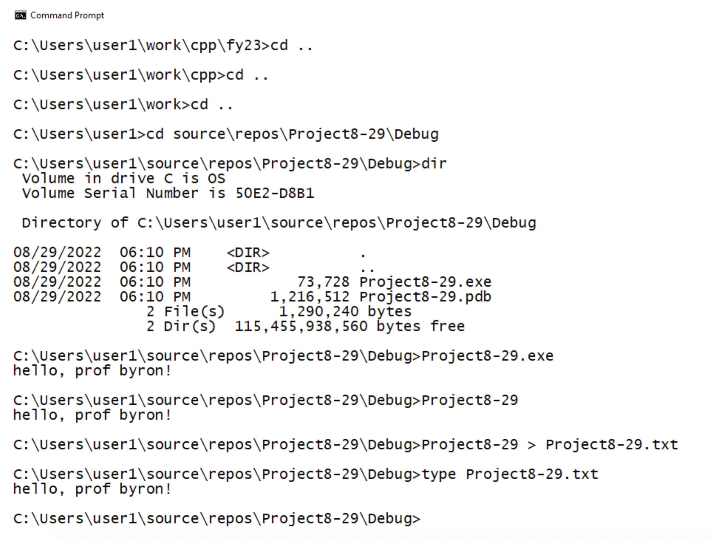
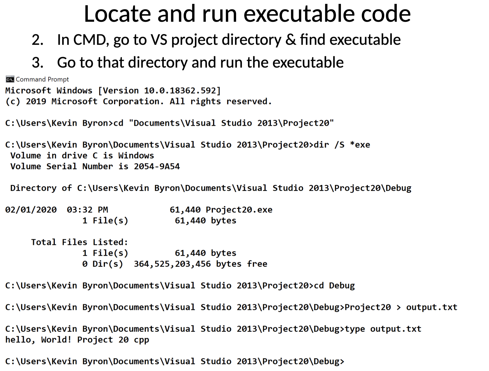

# bmcc_csc331_section501L_DSA

## Mac terminal commands:

```bash
g++ main.cpp personType.cpp -o program
./program > output.txt
```

Output.txt file containing:

1. Any compilation errors or warnings
2. All program output (cout, printf, etc.)
3. Any runtime error messages

```bash
# Using semicolon (runs second command even if first fails)
(g++ main.cpp personType.cpp -o program 2>&1; ./program 2>&1) > output.txt
```

```bash
# Feeding in a .dat file with pre-specified commands
(g++ csc331_501L_prog2_jiang.cpp -o program 2>&1; ./program < prog2.dat 2>&1) > output.txt
```

### Part-by-part Breakdown:

1. The Parentheses `()`
   - Creates a subshell (a new shell process)
   - Everything inside the parenthese is treated as a single unit
   - The final `> output` applies to all outputs from everything inside
2. `g++ main.cpp personType.cpp -o program`
   - Compile the C++ files
   - Output: Creates executable named `program` (if successful)
3. `2>&1` (First occurence)
   - `2` = stderr (standard error stream)
   - `1` = stdout (standard output stream)
   - `&1` = whereever stdout is currently going
   - `2>&1` = redirect stderr to the same place as stdout

So compilation erros that normally go to stderr will be merged with stdout.

4. The semicolon `;`

   - Command separator meaning "run this command, then run the next command"
   - Always runs the second command, regardless of whether the first succeeded or failed
   - Different from `&&` which only runs second command if first succeeds

5. `./program`
   - Execute the compiled program
   - `./` means "in current directory"
6. `2>&1` (Second occurence)

   - Same as before: redirect any runtime errors from the program to stdout
   - So, runtime errors get merged with program output

7. `> output.txt`
   - Redirects all output from the entire subshell to output.txt
   - Overwrites the file if it exists

### Visual Flow:

```bash
Compilation errors ──┐
Compilation output ──┼── stdout ──┐
Program output ──────┘            ├── output.txt
Runtime errors ───────────────────┘
```

## Windows command prompt commands:

```bash
# Windows Command Prompt:
g++ csc331_501L_prog3_jiang.cpp -o program.exe > output.txt 2>&1 && program.exe >> output.txt 2>&1

## Feeding in a .dat file with pre-specified commands
(g++ csc331_501L_prog3_jiang.cpp -o program.exe 2>&1 & program.exe < prog3.dat 2>&1) > output.txt

# ==================================

# Windows Powershell:
g++ csc331_501L_prog3_jiang.cpp -o program.exe 2>&1 | Out-File output.txt; ./program.exe 2>&1 | Out-File output.txt -Append

## Feeding in a .dat file with pre-specified commands
g++ csc331_501L_prog3_jiang.cpp -o program.exe 2>&1 | Out-File output.txt; Get-Content prog3.dat | ./program.exe 2>&1 | Out-File output.txt -Append
```




## Using Emscripten SDK Guide:

"Emscripten is a complete compiler toolchain to WebAssembly, using LLVM, with a special focus on speed, size, and the Web platform."

Make sure github pages is enabled and repo is public!

### Step 1: Install Emscripten (on desktop/ local machine - DO NOT INSTALL IN REPO FOLDER)

Every time you open a new terminal, you need to activate Emscripten before using emcc every terminal session!

```bash
# Navigate to Desktop (or wherever you want to install it)
cd C:\Users\Jason\Desktop

# Clone emsdk
git clone https://github.com/emscripten-core/emsdk.git

# Enter the directory
cd emsdk

# Install latest version
.\emsdk install latest # Windows
./emsdk install latest # Mac

# Activate it
.\emsdk activate latest # Windows
./emsdk activate latest # Mac

# Set up environment variables (do this in each new terminal session)
source ~/Desktop/emsdk/emsdk_env.sh  # On Linux/Mac if you git cloned to Desktop
# OR
emsdk_env.bat          # On Windows
.\emsdk_env.bat
```

Pro Tip Windows: Add to PATH Permanently on Windows!
To avoid running emsdk_env.bat every time, you can add Emscripten to your system PATH:

1. Search for "Environment Variables" in Windows
2. Click "Environment Variables"
3. Under "User variables", select "Path" and click "Edit"
4. Click "New" and add: C:\Users\Jason\Desktop\emsdk\upstream\emscripten
5. Click OK on all dialogs
6. Restart your terminal

Verify Installation:

```bash
emcc --version
```

Pro Tip Mac: Add the Emscripten environment to your shell configuration file! (Note: Macs by default use zsh now)

- In .zhrc:

```bash
# Remove the incorrect line from .zshrc if needed:
nano ~/.zshrc

# After deleting the line with the wrong path, add:
source ~/Desktop/emsdk/emsdk_env.sh

# Save (Ctrl+O, Enter, Ctrl+X)

# Reload your shell config
source ~/.zshrc
```

- In .bash_profile:

```bash
# Open bash config file
nano ~/.bash_profile

# Add this line at the end:
source ~/Desktop/emsdk/emsdk_env.sh

# Save (Ctrl+O, Enter, Ctrl+X)

# Reload
source ~/.bash_profile
```

### Step 2: Modify Your C++ Code for Web

- Add one function - evaluateExpression() that JavaScript can call
- Use #ifdef **EMSCRIPTEN** - web code only compiles for web, not terminal
- Modify the C++ file to exclude main() when compiling for web
- No prompt() dialogs!

### Step 3: Create the HTML Interface

In the same folder, create index.html

### Step 4: Compile Your Code

```bash
# Navigate to your assignment directory/ project
cd C:\Users\Jason\Desktop\bmcc_csc331_section501L_DSA\assignments\assignment_3\assignment_3

# Compile the C++ code to WebAssembly
emcc .\csc331_501L_prog3_jiang_web.cpp -o postfix_calculator.js -s WASM=1 -lembind -s ALLOW_MEMORY_GROWTH=1 -s INVOKE_RUN=0 -s EXPORTED_RUNTIME_METHODS='["cwrap","ccall"]'

# This will generate two files:
# .js (JavaScript glue code)
# .wasm (WebAssembly binary)
```

### Step 6: Test Locally

```bash
# Still in the main.cpp directory:

# Option 1: Python
python3 -m http.server 8000

# Option 2: Python 2
python -m SimpleHTTPServer 8000

# Option 3: Node.js (if installed)
npx http-server -p 8000

# Option 4: PHP (if installed)
php -S localhost:8000
```

Then open your browser to: (e.g. http://localhost:8000/postfix_calculator.html)
